# Atividade Docker + CI — NELSON CONCHO

> Preencha todos os campos marcados com `[...]` e substitua os prints de exemplo pelos seus. Salve as imagens em `docs/imagens/` e mantenha os nomes de arquivo indicados.

**Aluno(a):** NELSON ENRIQUE CONCHO ACOSTA  
**Turma:** ITEAM NOITE  
**Data:** 24/07/2026  
**Aplicação usada:** `docker/getting-started-app` — To-Do em Node.js

---

## 1. Como executar este projeto

```bash
git clone https://github.com/cheest-hub/my-firt-project-docker.git
cd MEU-PROJETO-DOCKER
cp .env.example .env
docker compose up -d --build
```

**Acesse:** http://localhost:3000

**Para derrubar:**  
`docker compose down` (mantém dados) ou `docker compose down -v` (apaga dados).


---

## 2. Imagem e Dockerfile multi-stage

- **Estágios utilizados:** [ex.: builder (instala dependências) e estágio final (runtime enxuto)]
- **Imagem base:** `node:20-alpine` (nos dois estágios)
- **Usuário de execução:** node, não-root
- **Tamanho final da imagem:** 68,4MB

**Por que o multi-stage ajuda?**  
Dockerfile com dois estágios build pra diminuir o tamanho da imagem, diminuir a superfície de ataque.

**Print 1 — build + docker images**  
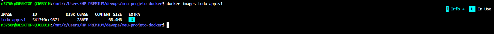

**Print 2 — aplicação rodando com tarefas cadastradas**  
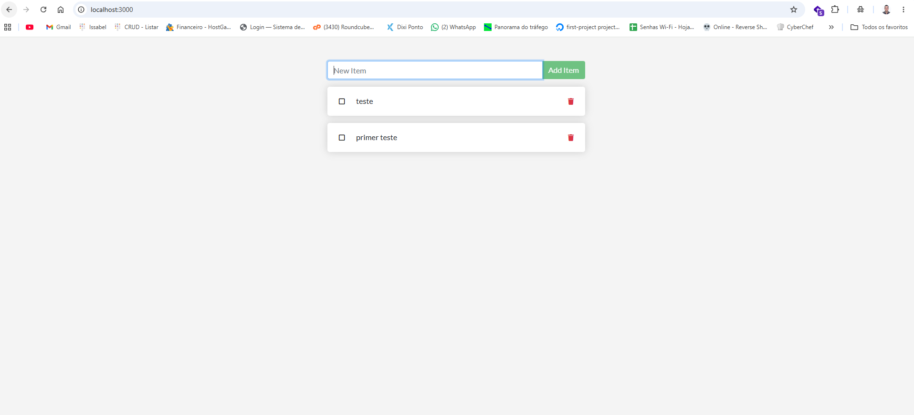

---

## 3. Volumes e persistência

- **Volume usado:** `[mysql-data]` → montado em `[/var/lib/mysql]`

**Print 3 — SEM volume: dados perdidos ao recriar o container**  
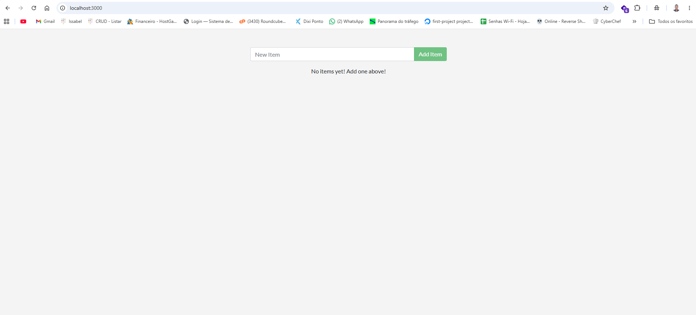

**Print 4 — COM volume: dados preservados**  
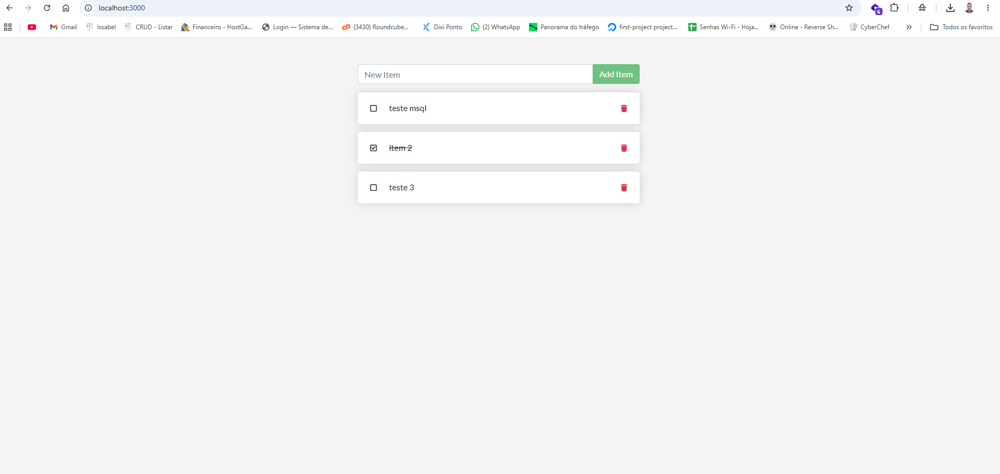

**Diferença entre `docker compose down` e `docker compose down -v`:**  
`docker compose down` mantém os dados e `docker compose down -v` limpa os volumes completamente.

---

## 4. Rede

- **Rede criada:** todo-net
- **Serviços conectados:** app e db
- **A porta do banco está exposta ao host?** Não, a comunicação é pelo nome do host.
- **Por que o app consegue chamar o host mysql / db sem saber o IP?** Todo-net.

**Print 5 — docker network inspect**  
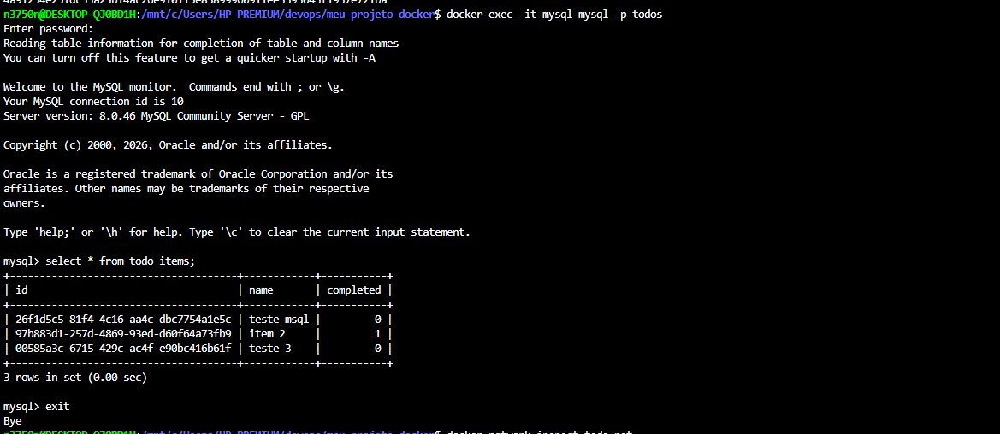

**Print 6 — dados dentro do MySQL (`select * from todo_items;`)**  
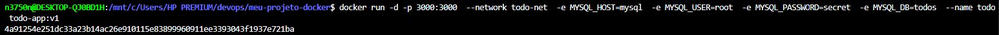

---

## 5. Docker Compose

- **Serviços:** [app, db]
- **Rede:** todo-net
- **Volume:** todo-mysql-data:/var/lib/mysql
- **Healthcheck em:** [db]
- **depends_on com:** `[condition: service_healthy]`
- **Variáveis sensíveis:** carregadas via `.env` (não versionado). Modelo em `.env.example`.

**Print 7 — docker compose ps**  
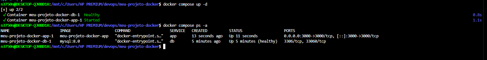

---

## 6. Integração Contínua (GitHub Actions)

- **Arquivo do workflow:** `.github/workflows/ci.yml`
- **Gatilhos:** [push e pull_request]
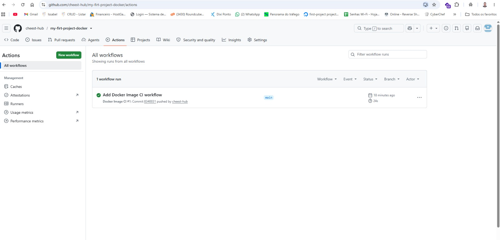

**O que o pipeline faz:**
1. [valida o compose]
2. [builda a imagem]
3. [sobe a stack]
4. [aguarda a app responder e testa criar uma tarefa via API]
5. [derruba a stack]

---

## 7. Quebra proposital do CI

- **O que eu quebrei:** alterei a porta do teste para 30001
- **Erro que apareceu no log:** Error: Process completed with exit code 1.
- **Como o CI reagiu:** A aplicacao nao subiu a tempo
- **Como eu corrigi:** coloquei de volta porta 3000
- **Link do Pull Request:** [\[URL\]](https://github.com/cheest-hub/my-firt-project-docker/actions/runs/30168723001/job/89706033789#step:7:96)
- **Evidencias do ci**
- **Error de Porta**
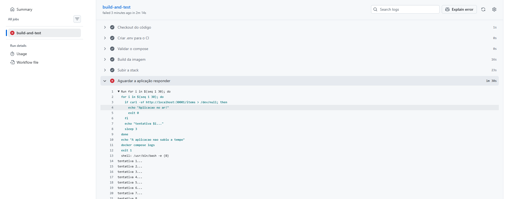
-  **error corrigido**
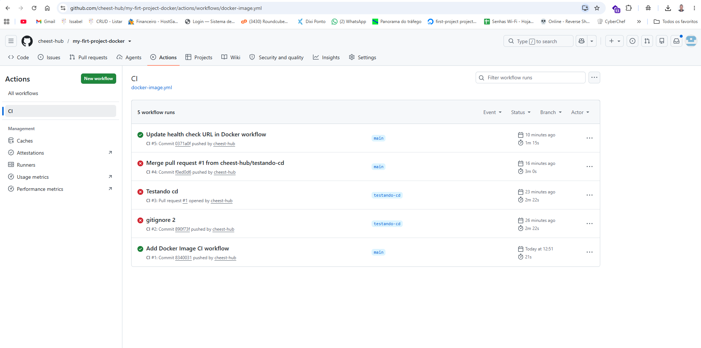


---

## 8. Dificuldades e aprendizados

Tive dificuldades com o contêiner do MySQL reiniciando em loop (Exited 1) devido à passagem incorreta da variável MYSQL_USER=root e com a aplicação não conectando por falta do .env no pipeline. Resolvi ajustando o compose.yaml para passar apenas a MYSQL_ROOT_PASSWORD ao banco, enquanto o app recebia as credenciais completas, e gerando um .env dinâmico no GitHub Actions. Com essa atividade, ficou muito mais claro como o Docker isola os serviços em uma rede interna, a importância crucial do mapeamento exato das variáveis de ambiente e a necessidade de limpar volumes (down -v) ao diagnosticar falhas.

---

## 9. Checklist de autoavaliação

- [x] Dockerfile multi-stage funcionando
- [x] `.dockerignore` presente
- [x] Container não roda como root
- [x] Volume nomeado + persistência demonstrada
- [x] Rede nomeada + banco não exposto ao host
- [x] `compose.yaml` sobe tudo com um comando
- [x] `.env` no `.gitignore` e `.env.example` versionado
- [x] CI verde
- [x] PR com CI vermelho documentado
- [x] Todos os 9 prints no README

# CD — Publicação no Docker Hub

**Aluno(a):** NELSON ENRIQUE CONCHO ACOSTA 
**Turma:** Noturno  
**Usuário do Docker Hub:** https://github.com/cheest-hub      
**Imagem publicada:** n3750n/meu-projeto-docker
**Link da imagem no Docker Hub:** https://hub.docker.com/r/n3750n/meu-projeto-docker

**Dispara quando:** push na branch `main`  
**Arquivo do workflow:** `.github/workflows/cd.yml`

## Print 1 — Token criado no Docker Hub

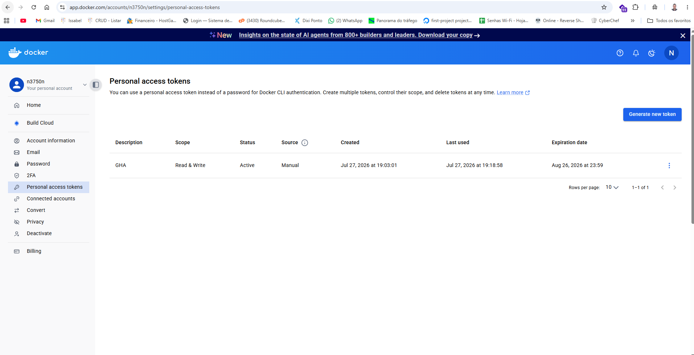

---

## Print 2 — Secrets cadastrados no GitHub (DOCKERHUB_USERNAME e DOCKERHUB_TOKEN)

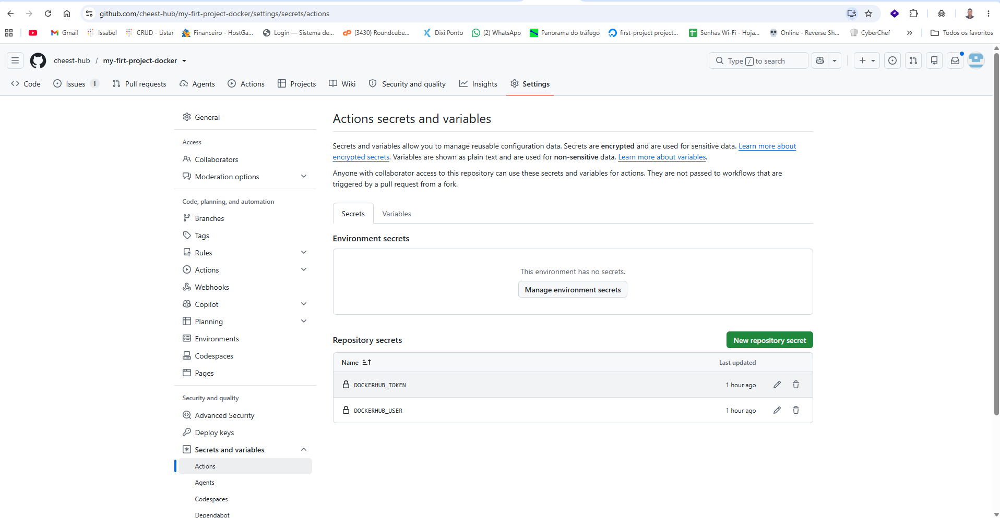

---

## Print 3 — Workflow de CD verde na aba Actions

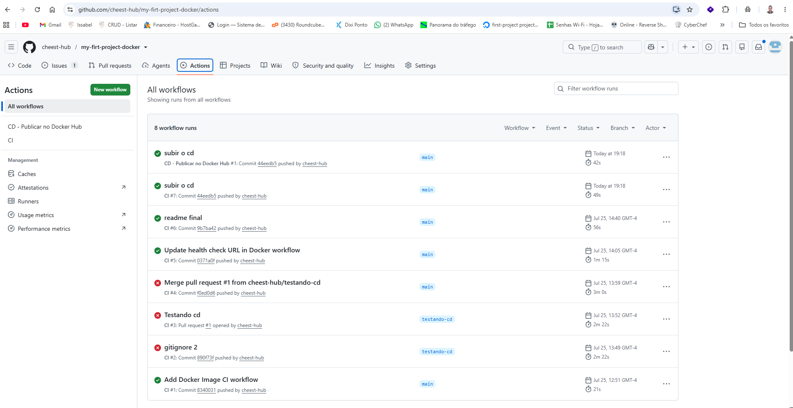

---

## Print 4 — Imagem publicada no Docker Hub

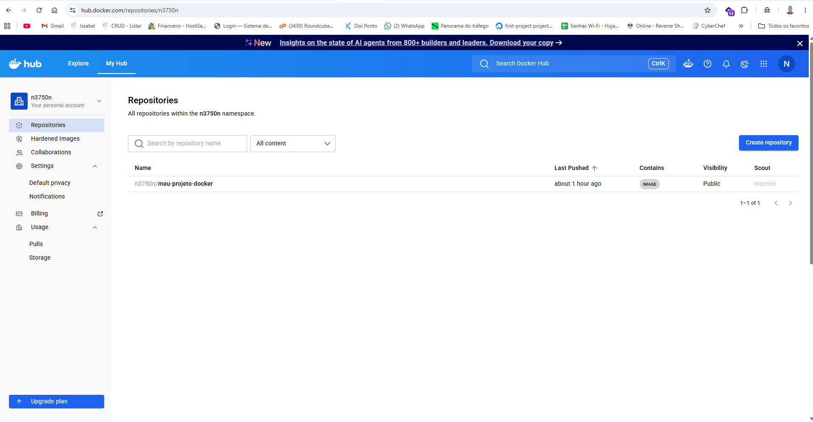

---

## Print 5 — Docker Pull baixando a imagem publicada

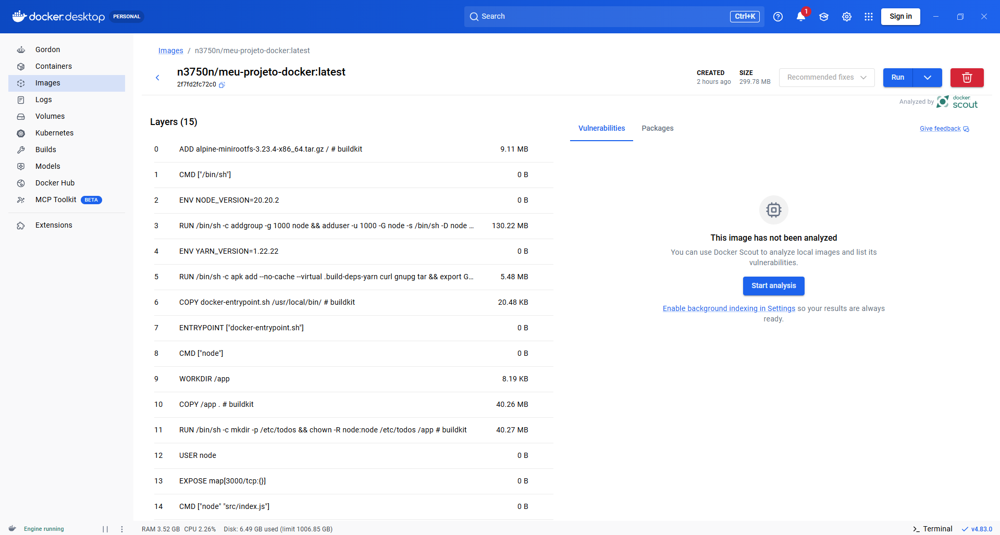

---

# Respostas

### 1. O que é o Docker Hub?

O Docker Hub é um serviço de armazenamento de imagens Docker. Ele permite publicar, compartilhar e baixar imagens para que aplicações possam ser executadas em qualquer ambiente que tenha Docker instalado.

### 2. Diferença entre CI e CD

O CI (Continuous Integration) automatiza a validação do projeto, executando testes e verificando se a aplicação funciona após cada alteração enviada ao repositório. Já o CD (Continuous Delivery) automatiza a publicação da imagem Docker no Docker Hub, tornando-a disponível para uso.

### 3. Por que usar Token e Secrets em vez de escrever usuário e senha no `cd.yml`?

Porque os Secrets armazenam informações sensíveis de forma segura no GitHub. Assim, o usuário e o token não ficam expostos no código do repositório, reduzindo riscos de acesso não autorizado.

### 4. O que significa a tag `latest`?

A tag `latest` representa a versão mais recente da imagem publicada no Docker Hub. Sempre que uma nova imagem é enviada utilizando essa tag, ela passa a ser considerada a versão mais atual do projeto.